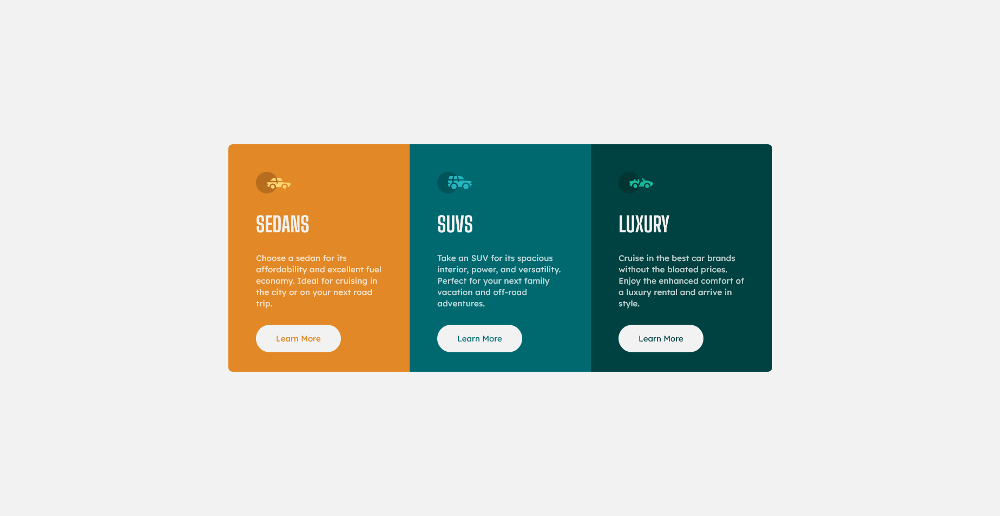

# Frontend Mentor - 3-column preview card component solution

This is a solution to the [3-column preview card component challenge on Frontend Mentor](https://www.frontendmentor.io/challenges/3column-preview-card-component-pH92eAR2-). Frontend Mentor challenges help you improve your coding skills by building realistic projects.

## Table of contents

- [Overview](#overview)
  - [The challenge](#the-challenge)
  - [Screenshot](#screenshot)
  - [Links](#links)
- [My process](#my-process)
  - [Built with](#built-with)
  - [Useful resources](#useful-resources)
- [Author](#author)

**Note: Delete this note and update the table of contents based on what sections you keep.**

## Overview

### The challenge

Users should be able to:

- View the optimal layout depending on their device's screen size
- See hover states for interactive elements

### Screenshot

### Links

- Solution URL: [github](https://github.com/PiterMobile/Challenge/tree/master/3-column-preview)
- Live Site URL: [Order-summary](https://pitermobile.github.io/Challenge/3-column-preview/)

## My process

### Built with

- Semantic HTML5 markup
- CSS custom properties
- Flexbox
- Mobile-first workflow

### Useful resources

- [CSS Media Queries](https://www.w3schools.com/Css/css3_mediaqueries_ex.asp) - Media queries are a popular technique for delivering a tailored style sheet to different devices.
- [CSS custom properties (variables)](https://developer.mozilla.org/en-US/docs/Web/CSS/Using_CSS_custom_properties) - Custom properties (sometimes referred to as CSS variables or cascading variables) are entities defined by CSS authors that contain specific values to be reused throughout a document.
- [Guide to Flexbox](https://css-tricks.com/snippets/css/a-guide-to-flexbox/) - Comprehensive guide to CSS flexbox layout

## Author

- Frontend Mentor - [@PiterMobile](https://www.frontendmentor.io/profile/PiterMobile)
